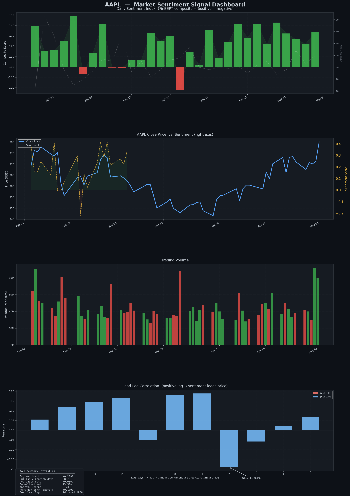
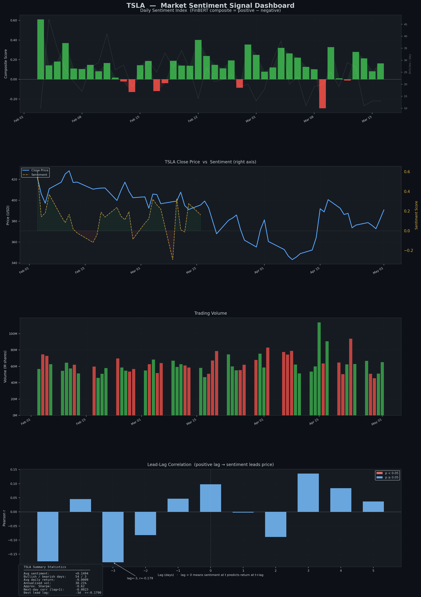

# Market Sentiment Signal Extractor

A quantitative data pipeline that fetches financial news, scores it using **FinBERT** (a BERT model fine-tuned on financial text), and correlates daily sentiment signals against stock price movement to identify lead-lag relationships.

Built as part of a personal research project to explore whether news sentiment has predictive power over short-term price returns.

---

## What it does

- Fetches financial news articles for a given ticker via **Alpha Vantage** (primary), **NewsAPI**, or **Yahoo Finance** (fallback)
- Scores each article using **ProsusAI/FinBERT**, producing positive / negative / neutral probabilities
- Aggregates article-level scores into a **confidence-weighted daily sentiment index**
- Downloads price history via **yfinance** and computes daily returns
- Runs **Pearson lead-lag correlation** across ±5 day windows to test whether sentiment predicts price movement
- Outputs a 4-panel dark-theme dashboard (PNG) and CSV exports

---

## Usage

```bash
pip install -r requirements.txt
python main.py --ticker AAPL --days 90 --av-key <YOUR_ALPHA_VANTAGE_KEY>
python main.py --ticker TSLA --days 90 --av-key <YOUR_ALPHA_VANTAGE_KEY>
python main.py --ticker MSFT --days 60 --include-sec
python main.py --ticker NVDA --days 30 --no-dashboard
```

Get a free Alpha Vantage API key at [alphavantage.co](https://www.alphavantage.co) (25 requests/day, genuine historical coverage).

---

## Dashboard panels

| Panel | What it shows |
|-------|--------------|
| 1 — Daily Sentiment Index | FinBERT composite score (positive − negative) per day. Green = bullish, red = bearish. Dashed line = article count (right axis) — low article-count days have noisier sentiment readings. |
| 2 — Price vs Sentiment | Close price (blue, left axis) overlaid with daily sentiment score (yellow dashed, right axis). Shows visually where sentiment and price agree or diverge. |
| 3 — Trading Volume | Daily volume coloured by price direction: green = up day, red = down day. Large green bars indicate conviction buying; large red bars indicate conviction selling. |
| 4 — Lead-Lag Correlation | Pearson r at each lag from −5 to +5 days. Positive lag = sentiment leads price. Negative lag = price leads sentiment. Red bars = statistically significant (p < 0.05). |

---

## Findings: AAPL (90-day window, Feb–May 2025)



### Key statistics
| Metric | Value |
|--------|-------|
| Avg sentiment | +0.2898 (strongly positive) |
| Bullish / bearish days | 58 / 1 |
| Avg daily return | +0.0007 |
| Annualised volatility | 25.51% |
| Approx. Sharpe | 0.73 |
| Next-day correlation (lag=1) | +0.1891 |
| **Best lead lag** | **lag=2d, r=−0.191** |

### Observations

**Sentiment vs price divergence:** AAPL sentiment remained predominantly positive throughout the window, yet the price fell steadily from ~$278 to ~$245 through February–March before recovering to $280 by May. This is a classic *lagging sentiment* pattern — the market was already pricing in deterioration while news coverage stayed optimistic.

**Contrarian signal at lag=2:** The strongest lead-lag finding is a *negative* correlation at lag=+2 days (r=−0.191). This means positive sentiment today is weakly associated with a price decline two days later. This is consistent with the **sentiment mean reversion** effect documented in behavioural finance — when news is uniformly positive, it may signal that good news is already priced in, and the marginal effect reverses.

**Next-day momentum:** At lag=+1, the correlation is +0.1891 — positive sentiment today is weakly associated with a price rise tomorrow. The reversal then kicks in at day 2.

**Article volume:** The dashed line in panel 1 shows article count declining over the window, meaning later sentiment readings are based on fewer articles and carry more noise. This is a key methodological caveat.

---

## Findings: TSLA (90-day window, Feb–May 2025)



### Key statistics
| Metric | Value |
|--------|-------|
| Avg sentiment | +0.1494 (mildly positive) |
| Bullish / bearish days | 54 / 3 |
| Avg daily return | −0.0009 |
| Annualised volatility | 38.21% |
| Approx. Sharpe | −0.02 |
| Next-day correlation (lag=1) | −0.0023 |
| **Best lead lag** | **lag=−3d, r=−0.179** |

### Observations

**Sentiment-price divergence (opposite direction to AAPL):** TSLA news sentiment was mostly *positive* (54 bullish days vs 3 bearish, avg +0.1494), yet the stock declined from ~$425 to ~$345 over the same period. This suggests TSLA's price was driven primarily by **macro and momentum factors** (broader market selloff, tariff concerns, Musk-related news) that overrode company-specific sentiment.

**Price leads sentiment (lag=−3):** The best correlation is at lag=−3 days (r=−0.179), a *negative* lag. This means **price moves first, and news sentiment follows 3 days later** — journalists are reporting on what already happened rather than predicting what will happen. This is the opposite dynamic to AAPL.

**Near-zero next-day predictability:** The lag=+1 correlation is −0.0023, essentially zero. Sentiment has no next-day predictive power for TSLA in this window, consistent with macro factors dominating price action.

**High volatility:** TSLA's annualised vol of 38.21% vs AAPL's 25.51% reflects its higher sensitivity to non-fundamental news flow.

---

## Cross-ticker insight

| | AAPL | TSLA |
|---|---|---|
| Sentiment direction | Positive | Positive |
| Price direction | Down then recovery | Down throughout |
| Best lag | +2d (sentiment leads price) | −3d (price leads sentiment) |
| Best r | −0.191 | −0.179 |
| Interpretation | Contrarian mean reversion | Macro-driven, journalists lag market |

**AAPL and TSLA show structurally different signal dynamics.** For AAPL, news sentiment has weak but measurable *leading* power over price — suggesting company-specific news matters. For TSLA, price moves first and sentiment follows — suggesting external macro factors dominate, and by the time articles are written, the move has already happened.

This divergence implies that a one-size-fits-all sentiment strategy would perform differently across tickers, and that signal alpha is highly ticker-specific.

---

## Limitations

- Correlations are weak (|r| < 0.2) and not statistically significant at p < 0.05 — results are exploratory, not tradeable signals
- 90-day window is short; longer history would increase confidence
- Article volume varies significantly day-to-day, introducing noise
- FinBERT was trained on financial reports; headline-heavy news feeds may not be its optimal input domain
- No transaction cost or slippage modelling

---

## Tech stack

- **Python** — pandas, NumPy, matplotlib, scipy
- **FinBERT** (ProsusAI) via HuggingFace Transformers
- **Alpha Vantage** News Sentiment API
- **yfinance** for price history
- **SEC EDGAR** for optional 8-K filing ingestion

---

## Project structure

```
├── main.py                  # CLI entry point
├── src/
│   ├── ingestion.py         # News fetching (Alpha Vantage, NewsAPI, Yahoo)
│   ├── sentiment.py         # FinBERT scoring and daily aggregation
│   ├── validation.py        # Price data, merging, lead-lag correlation
│   └── visualization.py     # 4-panel dashboard and CSV export
└── output/
    ├── AAPL_sentiment_dashboard.png
    ├── TSLA_sentiment_dashboard.png
    ├── AAPL_daily_sentiment.csv
    ├── TSLA_daily_sentiment.csv
    ├── AAPL_lead_lag_correlation.csv
    └── TSLA_lead_lag_correlation.csv
```
